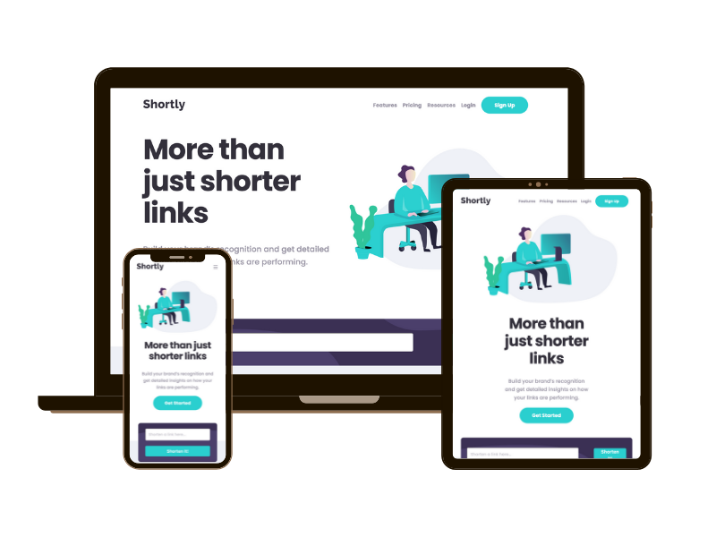

# Shortly URL shorter

Shorten any url using the Shortly URL shortening API site

## Frontend Mentor - Shortly URL shortening API Challenge solution

This is a solution to the [Shortly URL shortening API Challenge challenge on Frontend Mentor](https://www.frontendmentor.io/challenges/url-shortening-api-landing-page-2ce3ob-G). Frontend Mentor challenges help you improve your coding skills by building realistic projects.

## Table of contents

- [Overview](#overview)
  - [The challenge](#the-challenge)
  - [Links](#links)
- [My process](#my-process)
  - [Built with](#built-with)
  - [What I learned](#what-i-learned)
  - [Continued development](#continued-development)
  - [Useful resources](#useful-resources)
- [Author](#author)

## Overview

### The challenge

Users should be able to:

- View the optimal layout for the site depending on their device's screen size
- Shorten any valid URL
- See a list of their shortened links, even after refreshing the browser
- Copy the shortened link to their clipboard in a single click
- Receive an error message when the `form` is submitted if:
  - The `input` field is empty

### Links

- Solution URL: [Add solution URL here](https://your-solution-url.com)
- Live Site URL: [Add live site URL here](https://your-live-site-url.com)

## My process

### Built with

- Semantic HTML5 markup
- CSS custom properties
- Flexbox
- Mobile-first workflow

### What I learned

- Different methods for displaying overlapping content using CSS
- Using the HTML template tag and JS .cloneNode() method to dynamically render content
- How to handle promises returned from async functions
- Using session storage to render saved content on page refresh

### Continued development

- Gain further experience with mobile-first responsive development
- Gain further experience using session storage, local storage and cookies
- Gain further experience with rendering content dynamically
- Gain experience with a front-end framework such as React

### Useful resources

- [Web Dev Simplified blog post on using the HTML template tag](https://blog.webdevsimplified.com/2020-06/template-tag/) - Excellent post on using the HTML template tag to easily add dynamic content, whilst moving HTML out of Javascript.

- [Video from James Q Quick on Tips for using Async/Await in Javascript](https://www.youtube.com/watch?v=_9vgd9XKlDQ&list=PLwoAe_hC2kPUZ0nsGQPy1symPVmJIz9CI&index=37) - This is a great video which helped me get to grips with async/await and promises. I'd recommend it to anyone still learning this concept.

## Author

- Website - [Sarah Fielding Smith](https://www.your-site.com)
- Frontend Mentor - [@sazbot](https://www.frontendmentor.io/profile/sazbot)
- Twitter - [@sazbotty](https://www.twitter.com/sazbotty)
